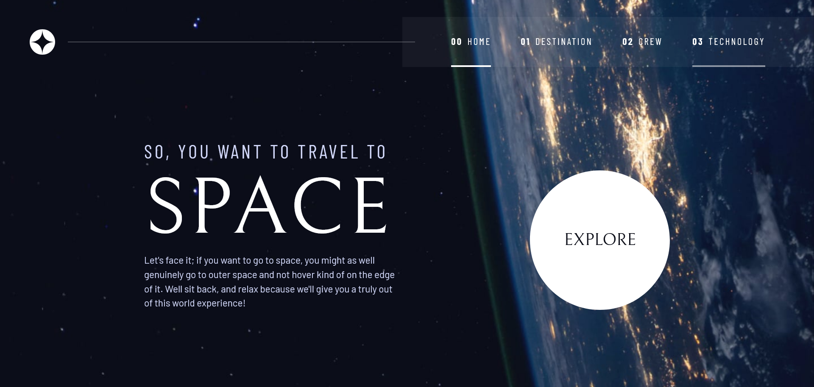
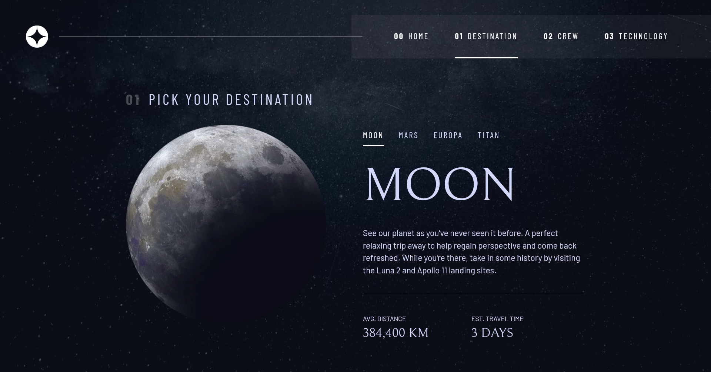
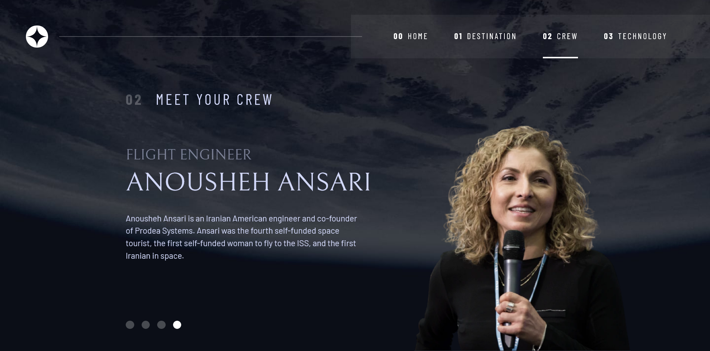
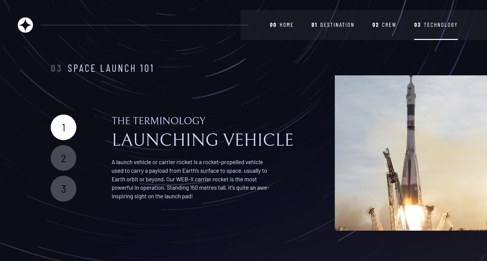

# Frontend Mentor - Space Tourism Website


## Welcome! 👋

# Frontend Mentor - Space Tourism Website Solution

This is a solution to the [Space tourism website challenge on Frontend Mentor](https://www.frontendmentor.io/challenges/space-tourism-multipage-website-gRWj1URZ3). Frontend Mentor challenges help you improve your coding skills by building realistic projects.

## Table of contents

- [Overview](#overview)
  - [The challenge](#the-challenge)
  - [Screenshot](#screenshot)
  - [Links](#links)
- [My process](#my-process)
  - [Built with](#built-with)
  - [What I learned](#what-i-learned)
  - [Useful resources](#useful-resources)
- [Author](#author)
- [Acknowledgments](#acknowledgments)

## Overview

### The challenge

Users should be able to:

- View the optimal layout for each of the website's pages depending on their device's screen size
- See hover states for all interactive elements on the page
- View each page and be able to toggle between the tabs to see new information

### Screenshot

## Desktop Preview



## Inner Page - Destination



## Inner Page - Crew



## Inner Page - Technology



### Links

- Solution URL: https://github.com/DwarakanathAkkala/Space-Travel-Site
- Live Site URL: https://space-tourism-frontend-mentor-dwaraka.netlify.app/

## My process

### Built with

- Semantic HTML5 markup
- CSS custom properties
- Flexbox
- CSS Grid
- Mobile-first workflow

### What I learned

```html
<!-- Updating the images based on viewport size of the device -->
<picture id="launch-image">
  <source
    srcset="assets/technology/image-launch-vehicle-landscape.jpg"
    media="(max-width: 719px)"
    type="image/jpg"
  />
  <source
    srcset="assets/technology/image-launch-vehicle-portrait.jpg"
    media="(min-width: 720px)"
    type="image/jpg"
  />
  
</picture>
```

```css
/* Re-declaring the predefined variables by not updating the base values */

.flex {
  display: flex;
  gap: var(--gap, 1rem);
}

/* Defining the Grid areas and updating the layout with Grid  */

proud-of-this-css {
  /* Mobile Layout */
  grid-template-areas:
    "title"
    "content"
    "tabs"
    "image";

  /* Desktop Layout */
  grid-template-columns:
    minmax(1rem, 0.5fr) minmax(1rem, 1fr) minmax(1rem, 1fr)
    minmax(0, 30rem);
  grid-template-areas:
    "title title title title"
    "tabs content content image";
}
```

```js
// Focusing the right tab on click/direction arrow keys and updating the content to be displayed.

function changeTabFocus(e) {
  const keydownLeft = 37;
  const keydownRight = 39;

  if (e.keyCode == keydownLeft || e.keyCode == keydownRight) {
    tabs[tabFocus].setAttribute("tabindex", -1);

    if (e.keyCode === keydownRight) {
      tabFocus++;
      if (tabFocus >= tabs.length) {
        tabFocus = 0;
      }
    } else if (e.keyCode === keydownLeft) {
      tabFocus--;
      if (tabFocus < 0) {
        tabFocus = tabs.length - 1;
      }
    }

    tabs[tabFocus].setAttribute("tabindex", 0);
    tabs[tabFocus].focus();
  }
}
```

### Useful resources

- Scrimba (https://scrimba.com/learn/spacetravel) - This helped me how to tackle the project javascript functions for the tabs where we switch between content. It also helped with a Component based approach where we use the same functions in different pages. For example, the dots in the Crew Page and the numbered dots in the Technology page which is used to view different content by switching like tabs is based on the single component function.

- Stack Overflow (https://stackoverflow.com/) - This helped me for viewing responsive images based on screen size of the device with the community solutions.

## Author

- Website - [Dwarakanath](https://dwarakanath-akkala.netlify.app/)
- Frontend Mentor - [@DwarakanathAkkala](https://www.frontendmentor.io/profile/DwarakanathAkkala)
- Instagram - [@dwarakanath_akkala](https://www.instagram.com/dwarakanath_akkala/)
